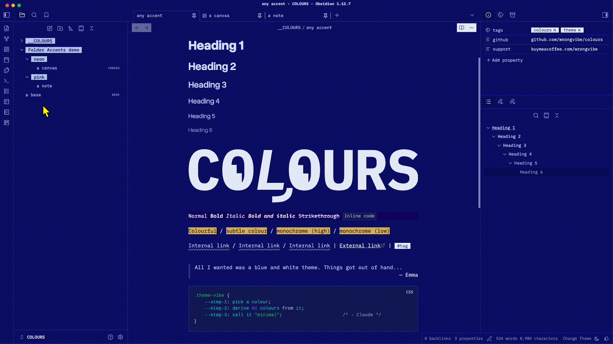
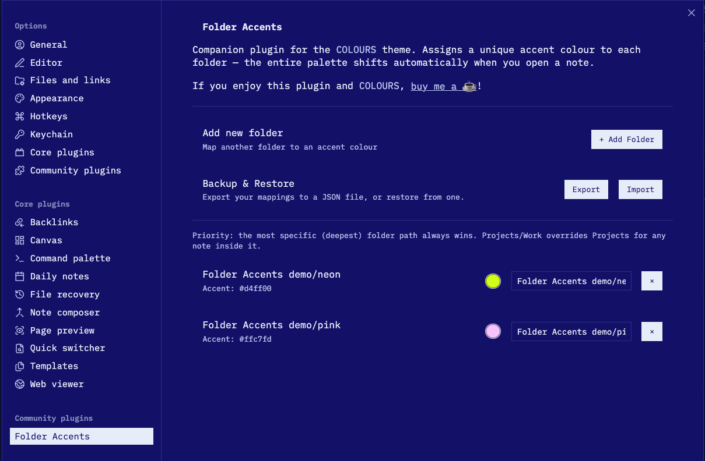

# Folder Accents

Automatically change Obsidian's accent colour based on which folder your note is in.



> **Companion plugin for the [COLOURS](https://github.com/wrongvibe/colours) theme.**
> COLOURS derives its entire palette from a single `--color-accent` variable. Folder Accents extends that by letting different parts of your vault have their own distinct colour identity, automatically, without any manual switching.
>
> It is designed specifically to unlock COLOURS' per-folder palette feature. Might work with any theme that respects `--color-accent`.

## How It Works

When you open a note, the plugin checks which folder it lives in. If the folder has a colour assigned, the entire UI shifts to that accent colour instantly. Open a note in a different folder and the colour follows.

## Features

- **Per-folder accent colours** — assign any colour to any folder
- **Subfolder inheritance** — `Projects/Work` inherits from `Projects` if no exact match is defined
- **Most-specific match wins** — no need to worry about order; deeper paths always take priority
- **Native folder search** — type to find folders, just like Obsidian's core plugins
- **Live preview** — colour changes the moment you switch files
- **Backup & Restore** — export and import your mappings as JSON

## Installation

### Manual

1. Download `main.js` and `manifest.json`
2. Create `.obsidian/plugins/folder-accents/` in your vault
3. Place both files there
4. **Settings → Community Plugins** → enable **Folder Accents**

### From Community Plugins

1. **Settings → Community Plugins → Browse**
2. Search for **Folder Accents**
3. Install and enable

## Usage

1. Open **Settings → Community Plugins → Folder Accents → Options**
2. Click **+ Add Folder**
3. Type a folder name — matching folders appear as you type
4. Pick a colour with the colour picker
5. Open any note in that folder — the accent changes automatically



To back up your mappings, use **Export** in the settings panel. To restore, use **Import**.

## Folder Priority

When a note could match more than one mapped folder, the **most specific path always wins** — meaning the longest matching folder path takes precedence, regardless of the order mappings appear in settings.

**Example:**

| Mapping | Colour |
|---|---|
| `Projects` | Blue |
| `Projects/Work` | Red |
| `Projects/Work/Active` | Green |

Opening a note in `Projects/Work/Active/note.md` applies **Green**, because `Projects/Work/Active` is the longest match. A note in `Projects/Work/old-note.md` gets **Red**. A note directly in `Projects/` gets **Blue**.

If only `Projects` is mapped, all notes inside it — including those in `Projects/Work` and deeper — inherit Blue. Add a more specific mapping at any time to override just that subtree.

## How It Works (Technical)

The plugin injects a small CSS override onto `<body>` when you open a file:

```css
body[data-folder-accent="folder-accent-0"] {
  --color-accent: #7F8C8D !important;
}
```

Because Obsidian themes derive UI colours from `--color-accent`, the entire interface updates instantly — no reload needed.

## Compatibility

- **Obsidian**: v0.15.0+
- **Mobile**: Yes (iOS and Android)
- **Themes**: Any theme using CSS `--color-accent`

## License

GPL-3.0
